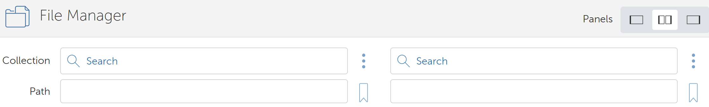

# Oak Ridge National Laboratory (ORNL) Data Challenge: EAGLE-I Outage Data 2014-2022
Overview of the challenge: "Restoring power after an outage event is a critical piece of response and recovery for those in the emergency response sector. When analyzing data on power outages, we seek to understand spatial and temporal patterns, restoration times, correlations with other relevant datasets, future outage predictions, expected outage behavior, and how we might fill in data gaps. Analysis at the county level is recommended when possible."

More details about the challenge can be viewed here: https://smc-datachallenge.ornl.gov/eagle/

## Dataset
The Environment for the Analysis of Geo Located Energy Information (EAGLE-I) monitors the number of customers experiencing outages at the county level across the United States. Covering 92% of US and territories, this dataset provided by ORNL provides a comprehensive, real-time source of outage information. The following information is provided:

* ``eaglei_outages_2014.csv``, ``eaglei_outages_2014.csv``, ``eaglei_outages_2015.csv``, ``eaglei_outages_2016.csv``, ``eaglei_outages_2017.csv``, ``eaglei_outages_2018.csv``, ``eaglei_outages_2019.csv``, ``eaglei_outages_2020.csv``, ``eaglei_otuages_2021.csv``, ``eaglei_outages_2022.csv``
    * Provides outage data for each county at intervals of 15 minutes. Entries where the value is 0 are omitted.

    * Columns:
        | Name | Pandas data type | Description |
        |:----:|:---------:|:-----------:|
        | fips_code | int64 | County FIPS code |
        | county | object | County name |
        | state | object | State name |
        | sum | float64 | The number of customers out of power. Can be converted to int64. |
        | run_start_time | object | Timestamp at which outages were recorded. Can be converted using `pd.to_datetime()` |
* ``coverage_history.csv``
    * Provides information about the minimum and maximum number of customers covered for each state for each year included in this dataset.
    * Columns: 
        | Name | Data type | Description |
        |:----:|:---------:|:-----------:|
        | year | object    | Date the information was recorded. Can be converted using `pd.to_datetime()` |
        | state | object   | The two character code for the state |
        | total_customers | int64 | The number of customers in the state for the year |
        | min_covered | int64 | The minimum number of customers covered |
        | max_covered | int64 | The maximum number of customers covered |
        | min_pct_covered | float64 | The minimum percent of customers covered |
        | max_pct_covered | float64 | The maximum percent of customers covered |

## Objectives
* Calculate outage durations for each county
* Find correlations between weather and social vulnerability datasets to corresponding outage data
* Forecast future outages

## Setup
### Dataset download
To download the datasets from the following links, you will need to use [Globus](https://www.globus.org/) and create an account. 
* If you are using an HPC: Once you sign in, check if there is a Globus collection hosted on your HPC in the 'File Manager' tab.

* In most other cases, install [Globus Connect Personal](https://www.globus.org/globus-connect-personal) on whichever device you would like to have these datasets downloaded to. Once your server is running, you can search for it like any other connection.

After Globus is set up, these links will help you search for download the dataset via Globus:
* EAGLE-I Umbrella DOI: https://doi.ccs.ornl.gov/ui/doi/436
* 2014-2022 DOI: https://doi.ccs.ornl.gov/ui/doi/435

### Other Datasets Used in This Repo
* [US Weather Events (Kaggle)](https://www.kaggle.com/datasets/sobhanmoosavi/us-weather-events)
* [National Weather Service Valid Time Extent Code (VTEC) Archives](https://mesonet.agron.iastate.edu/info/datasets/vtec.html)
* [Climate and Economic Justice Screening Tool](https://screeningtool.geoplatform.gov/en/)

### Python Packages
These can be installed using `pip`, `conda`, or `mamba`.
* Dataframes: `vaex`, `pandas`, `geopandas`
* Math: `numpy`
* Time series modeling: `darts`, `statsmodels`
* Forecasting: `prophet`, `xgboost`, `sklearn`, `pytorch`
* Plotting: `matplotlib`, `seaborn`

